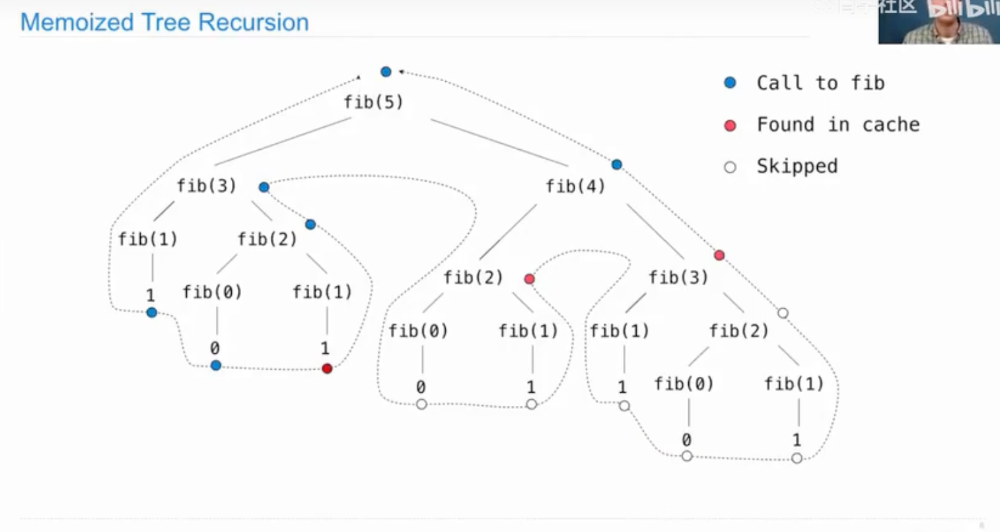

# 🧠 Memoization（记忆化）

## 📌 核心思想
Memoization 是通过缓存之前的结果，来避免重复计算递归函数的技术。
	•	用字典 cache = {} 保存已经计算过的结果。
	•	如果一个输入值之前出现过，直接从 cache 中取结果，不再递归调用。

## ✅ Python 实现模板

```python
def memo(f):
    cache = {}
    def memorized(n):
        if n not in cache:
            cache[n] = f(n)
        return cache[n]
    return memorized
```
## 图解：Memoized Tree Recursion
### 🎬 示例：fib(5) 的递归调用图
本图展示了使用 Memoization 优化后的 Fibonacci 递归过程。


图例元素          含义
🔵 蓝点        实际进行了递归调用（没有缓存）
🔴 红点        从缓存中获取的值，避免了递归
⚪️ 白点        因为前面已经缓存过，所以这个分支直接 跳过了，没有任何递归调用

## 💡 学习要点总结
✅ 什么时候用 Memoization？
•	当你有重叠子问题（如斐波那契）时，memoization 可以大大减少重复调用。
