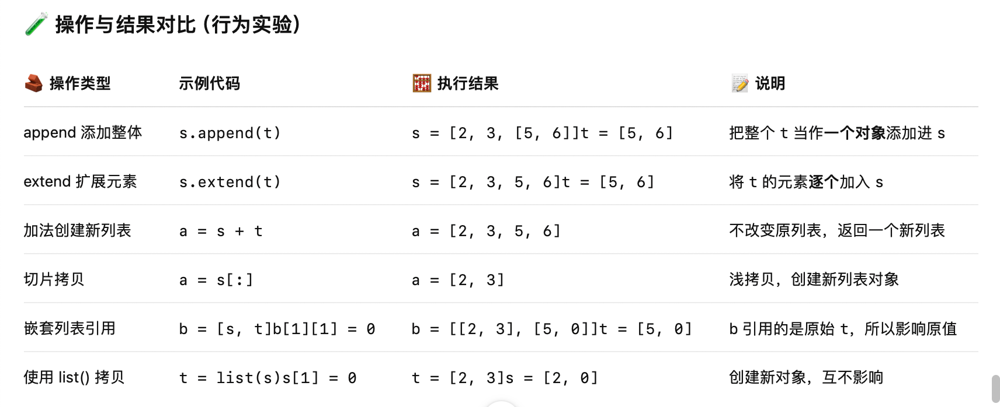

# 🧠 CS61A 学习笔记：Lists in Environment Diagrams

## 📌 主题说明  
本节课主要讲解 Python 中 **列表（list）对象**的行为与环境图（Environment Diagrams）之间的关系，帮助我们理解变量绑定、引用、浅拷贝与深拷贝的区别。

---

## ✅ 初始状态

```python
s = [2, 3]
t = [5, 6]
```
我们有两个列表 s 和 t，它们分别指向两块不同的内存空间。

## 🧪 操作与结果对比（行为实验）


## 📎 对比分析
✅ append vs extend 区别:
•	append(x)：将 x 整体作为一个元素添加进去。
•	extend(x)：把 x 拆开来添加，适用于列表合并。
✅ 引用 vs 拷贝:
类型                     表现             说明
引用（reference）修改一个变量会影响另一个     如：t = s
拷贝（copy）     修改原始列表不会影响新列表   如：t = s[:]、t = list(s)

## 🧠 编程思想（CS61A 重点）
•	所有列表变量其实是指针 / 引用。
•	多个变量可能指向同一个列表对象。
•	使用切片、list() 等方式可实现“新对象”的创建，避免副作用。
•	环境图帮助你分析变量、值、引用之间的关系。

🎯 总结：环境图的用途
•	✅ 理清变量和对象的绑定
•	✅ 帮助 debug（查找意外共享引用）
•	✅ 理解 Python 内存模型（可变对象 vs 不可变对象）
•	✅ 为理解函数调用、递归和对象导论打基础


# 🧠 CS61A 学习笔记：列表结构与引用逻辑

## 🧪 示例分析：嵌套列表 append 的行为

### ✅ 示例代码

```python
t = [[1, 2], [3, 4]]
t[0].append(t[1:2])
```
#### 🔍 第一步：初始化列表
t = [[1, 2], [3, 4]]
此时 t 是一个包含两个列表的列表：
	•	t[0] → [1, 2]
	•	t[1] → [3, 4]
#### 🧩 第二步：切片操作 t[1:2]:
t[1:2] → [[3, 4]]
	•	注意：这是一个新的列表，里面只有一个元素 [3, 4]
	•	它和 t[1] 不同：
	•	t[1] 是 [3, 4]
	•	t[1:2] 是 [[3, 4]]（嵌套一层）
#### 🔧 第三步：执行 append:
t[0].append(t[1:2])
•等价于：
[1, 2].append([[3, 4]])
•所以 t[0] 变成：
[1, 2, [[3, 4]]]

#### 🧱 最终结构
t = [
    [1, 2, [[3, 4]]],  # t[0]
    [3, 4]             # t[1]
]
### 🧠 知识点总结
	•	append(x) 是将 x 作为一个整体添加到列表末尾。
	•	list[a:b] 返回的是新的列表，不是原始元素。
	•	对列表的引用和嵌套，要注意每一层结构。