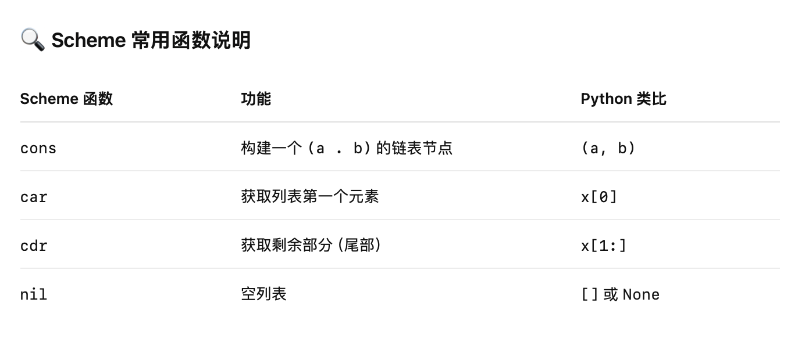

# 列表结构（Scheme Lists）

## 🧩 1. 列表基础：cons、car、cdr 与 nil
•cons：用于构造一对值（pair），通常用于构建链表
•car：返回 cons 生成的第一个值（相当于 Python 的 x[0]）
•cdr：返回 cons 生成的第二个值（相当于 Python 的 x[1:]）
•nil：表示空列表（类似 Python 中的 []）

## ✅ 2. 列表示例对比（Scheme vs Python）

```scheme
(cons 1 (cons 2 nil)) ; 输出: (1 2)
```

```python
(1, (2, None))              # Python 中类似的链表结构表示
```

## 🧠 3. Scheme 表达式详解
```scheme
(define x (cons 1 (cons 2 nil)))
```
•创建了一个包含两个元素的列表：(1 2)
•每个 cons 表示一对，嵌套构造出完整链表

###  🧪 使用 car 和 cdr 操作：
(car x)     ; 输出: 1
(cdr x)     ; 输出: (2)

## 📦 4. 更复杂的嵌套列表构造
```scheme
(cons 1 (cons 2 (cons 3(cons 4 nil))));输出：（1 2 3 4）
```
相当于：
```python
(1, (2, (3, (4, None))))
```
•实际上就是构造一个链式结构（链表）


## 🔍 5. Scheme 中的显示形式
```scheme
(1 2 3 4)
```
•	这只是 (cons 1 (cons 2 (cons 3 (cons 4 nil)))) 的简写形式
•	Scheme 会自动以括号+空格的形式输出链表


