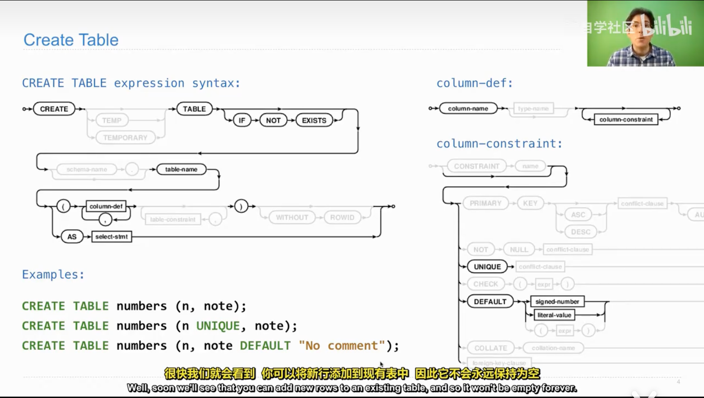
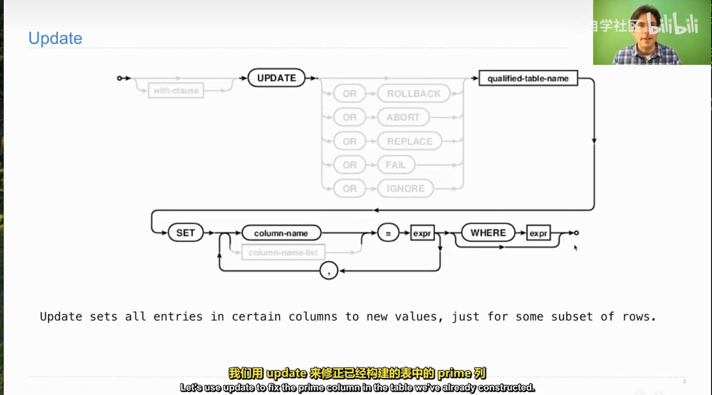

# Create Table and Drop Table
# SQL `CREATE TABLE` 语法详解:

## 1. 核心概念：语法图 (Syntax Diagrams)


PPT 中的流程图在计算机科学中被称为 **铁路图 (Railroad Diagrams)**。它是阅读编程语言官方文档的基础技能。

### 如何阅读
- **从左向右**：沿着线条的方向阅读。
- **圆角框/椭圆** (如 `CREATE`, `TABLE`)：**关键字 (Keywords)**。必须原样输入，不能修改。
- **方角框** (如 `table-name`)：**变量 (Variables)**。需要替换为自定义的名称。
- **分叉路径**：表示 **可选 (Optional)**。如果不走直线走弯路，代表该部分可以省略（例如 `IF NOT EXISTS`）。
- **回路/循环**：表示 **可重复 (Repeatable)**。通常配合逗号使用，表示可以定义多个项。

---

## 2. CREATE TABLE 基础语法

根据 PPT 左侧的主路径，基本结构如下：

```sql
CREATE [TEMP] TABLE [IF NOT EXISTS] table-name (
    column-def [, column-def]*
    [, table-constraint]*
) [WITHOUT ROWID];
```
### 2.1 关键组件解析
- `CREATE TABLE`：建表指令起点。

- `IF NOT EXISTS (可选)`：保护性语句。如果表已存在，SQL 引擎会忽略指令而不是报错。

- `table-name`：自定义的表名。

- `(...)`：括号内定义表的具体列结构。

## 3. 列定义与约束 (Column Definition)

### 3.1 语法结构
`列名` -> `类型(可选)` -> `约束(可选)`

### 3.2 常见约束 (Constraints)
约束是给数据立“规矩”，常见类型如下：

- `PRIMARY KEY` (主键)：整行数据的唯一标识，不能重复，不能为空。

- `UNIQUE` (唯一)：该列的值不能重复（例如：身份证号、用户名）。

- `CHECK` (检查)：插入数据时必须满足特定条件（例如：age > 0）。

- `DEFAULT` (默认值)：如果插入数据时未指定该列的值，系统自动填充此默认值。

## 4. 实例代码演示
### 示例 1: 最基础的建表
没有任何约束，最简单的形式。
```sql
CREATE TABLE numbers (n, note);
```
*含义*：创建一个名为 numbers 的表，包含 n 和 note 两列。

### 示例 2: 添加 UNIQUE (唯一) 约束

```sql
CREATE TABLE numbers (n UNIQUE, note);
```
*含义*：n 这一列的值必须是唯一的。如果尝试插入重复的 n 值，数据库会报错。

### 示例 3: 添加 DEFAULT (默认值)
```sql
CREATE TABLE numbers (n, note DEFAULT "No comment");
```
*含义*：

如果你插入时指定了 note：VALUES(1, "Hello") -> note 为 "Hello"

如果你插入时忽略了 note：VALUES(1) -> note 自动填为 "No comment"

**补充：使用 CREATE TABLE 只是造出了一个空的容器（Empty Table）。**

# `Drop` Table 

## 1. 核心功能
`DROP TABLE` 用于从数据库中**彻底删除**一张表。
* **注意**：这是一个破坏性操作，表结构和表内的所有数据都会被永久移除。

## 2. 语法结构与安全机制

语法图路径：`DROP` -> `TABLE` -> `[IF EXISTS]` -> `表名`

### 2.1 两种写法的区别

#### 写法 A：强制删除 (不推荐在脚本中使用)
```sql
DROP TABLE numbers;
```
*逻辑*：命令数据库直接删除 numbers 表。

*风险*：如果 numbers 表根本不存在，SQL 会报错 (Error)，导致程序中断。

#### 写法 B：安全删除 (推荐)
```sql
DROP TABLE IF EXISTS numbers;
```
*逻辑*：
- 先检查 numbers 表是否存在。
- 如果存在 -> 删除它。
- 如果不存在 -> 忽略该命令，不报错。

*优势*：这种写法被称为“幂等性”操作，无论运行多少次，结果都是安全的，不会导致程序崩溃。

# SQL `INSERT` 语句学习笔记

## I. INSERT 语句概述
`INSERT` 语句用于向数据库的 表 中添加新的 行（记录）。

## II. 语法结构与选项 (基于 Railroad Diagram)

`INSERT` 语句的基本结构是 :
**`INSERT [OR resolution] INTO table_name ...。`**

### A. 冲突处理子句 (OR resolution)
- 在 INSERT 之后可以指定 OR 关键字，以及一个冲突解决动作，用于处理插入操作违反数据库约束（如 PRIMARY KEY 或 UNIQUE）时的情况。

| 动作 (Action) | 描述 (Description) |
|--------------|---------------------|
| OR REPLACE   | 如果发生冲突，删除导致冲突的现有行，然后插入新行。 |
| OR ROLLBACK  | 遇到冲突时，回滚整个事务（中止并撤销所有更改）。 |
| OR ABORT     | 遇到冲突时，中止当前 SQL 语句（默认行为），并回滚该语句所做的更改。 |
| OR FAIL      | 遇到冲突时，中止当前 SQL 语句，但不回滚事务中该语句之前的更改。 |
| OR IGNORE    | 遇到冲突时，忽略该行数据，继续处理后续的插入操作。 |

### B. 目标和数据源
*目标*： `INTO` 后面跟 `table-name`（表名），以及可选的 `(column-name, ...)` 列名列表。

*数据源*：

`VALUES`: 插入明确指定的值列表。

`select-stmt`: 使用 SELECT 语句的结果集作为要插入的数据。

`DEFAULT VALUES`: 插入一行，所有列都使用其定义的默认值（或 NULL）。

### III. 常见用法示例

假设有一个表 `t` 包含两列数据，以下是两种基本的插入方法：

#### A. 插入到指定列

只为表 `t` 中的 `特定列` 插入数据。未指定的列将使用`默认值`或`NULL`。

```sql
INSERT INTO t(column) VALUES (value);
```
#### B. 插入到所有列
为表 `t` 中的 `所有列` 依次提供数据。值的数量必须与表的列数一致。

```sql
INSERT INTO t VALUES (value0, value1);
```
*  *关键点*： 如果你没有指定列名列表，VALUES 中的值将按照表定义的列顺序依次插入。


# `UPDATE` 语句学习笔记

`UPDATE` 语句用于修改数据库表中 **现有行** 的**现有数据**。它只会更改表中部分行的部分列。

*作用*：UPDATE 的作用是根据 SET 子句的指令，将满足 WHERE 条件的行的特定列的值**从旧值改为新值**。

> *定义*： Update sets all entries in certain columns to new values, just for some subset of rows.（UPDATE 为某些列设置新值，但仅针对行的子集。）

## A. 语法结构 (基于 Railroad Diagram)
`UPDATE` 语句的基本结构是：

```sql
UPDATE [OR resolution] qualified-table-name SET column-name = expr, ... [WHERE expr];
```

## B. 语法组成部分详解


### 1. 冲突处理子句 (`OR resolution`)
与 `INSERT` 类似，`UPDATE` 后面可以接 `OR` 加上一个冲突解决动作，用于处理更新操作违反数据库约束（如 `PRIMARY KEY` 或 `UNIQUE`）时的情况。

| 关键字 (Keyword) | 冲突处理行为 (Conflict Behavior) |
|------------------|----------------------------------|
| OR ROLLBACK      | 遇到冲突时，**回滚** 整个事务。 |
| OR ABORT         | 中止当前 SQL 语句，并回滚该语句所做的更改（**默认行为**）。 |
| OR REPLACE       | 如果发生冲突，**删除** 导致冲突的现有行，然后 **替换** 为更新后的行。 |
| OR FAIL          | 中止当前 SQL 语句，但 **不回滚** 事务中该语句之前的更改。 |
| OR IGNORE        | 遇到冲突时，**忽略** 该行数据，跳过该行的更新。 |

### 2. `qualified-table-name`(表名)
指定要更新数据的表名。

### 3. SET 子句
这是 `UPDATE` 的核心部分，用于**指定要更新的列及其新值**。（要改成什么）

`SET` 后面跟一个或多个逗号分隔的赋值表达式：`column-name = expr`。

`expr` 可以是**常量、计算结果或子查询**。

### 4. WHERE 子句 (可选但常用)
用于指定哪些行应该被更新。（指定条件）

`WHERE` 后面跟一个表达式 (expr)，只有满足该表达式（即表达式结果为 TRUE）的行才会被修改。

重要： 如果省略 WHERE 子句，**表中的所有行都会被更新！**


# `DELETE`语句学习笔记
## I. `DELETE` 语句概述

`DELETE` 语句用于从表中删除（移除）一些或所有行。

*定义*： Delete removes some or all rows from a table.（DELETE 从表中移除部分或全部行。）

### A. 语法结构 (基于 Railroad Diagram)
DELETE 语句的结构相对简单：
```sql
DELETE FROM qualified-table-name [WHERE expr];
```
### B. 语法组成部分详解
1. `DELETE FROM`
这是语句的开头，表示要执行删除操作。

后面紧跟 qualified-table-name（要删除数据的表名）。

2. `WHERE` 子句 (可选但非常重要)
`WHERE` 后面跟一个表达式 (expr)，用于指定哪些行应该被删除。

只有满足该表达式（结果为 TRUE）的行才会被从表中移除。

*⚠️ 警告*： 如果省略 `WHERE` 子句，表中的所有行都将被删除！

3. 结果
`DELETE` 成功执行后，满足条件的行将不再存在于表中。

*注意*： 删除行后，**表本身仍然存在**，但表中可能没有任何数据（But that table will have no rows, only empty columns after you delete from it.）。


# Python 与 SQLite 交互
* *核心*:展示如何在 Python 中使用 `sqlite3` 模块来创建和操作一个关系型数据库（SQLite）。
---
## I. 💻 右侧：Python 代码 (`ex.py`) 分析

这部分代码演示了连接数据库、定义表结构、插入数据以及查询数据的完整流程。

### 1. 建立连接与导入

| 代码 | 作用 | 知识点 |
| :--- | :--- | :--- |
| `import sqlite3` | 导入 Python 内置的 SQLite 数据库驱动模块。 | **模块导入**：使用标准库操作数据库。 |
| `db = sqlite3.connect("n.db")` | 连接到名为 `n.db` 的数据库文件。如果文件不存在，则创建它。 | **持久化存储**：数据存储在文件中。`db` 是连接对象。 |

### 2. 创建数据表 (`CREATE TABLE`)

```python
db.execute("CREATE TABLE nums AS SELECT 2 UNION SELECT 3")
```
- SQL 语句:` CREATE TABLE nums AS SELECT 2 UNION SELECT 3`

- 作用: 创建一个名为 `nums` 的新表。

- 表包含 **一列** 数据，初始内容是两个值：2 和 3。

表结构: `nums` 表是一个包含单列和两行的表，内容为 (2) 和 (3)。

### 3. 插入数据 (`INSERT INTO`)

```python
db.execute("INSERT INTO nums VALUES (?),(?),(?);", range(4, 7))
```
- SQL 语句: `INSERT INTO nums VALUES (?),(?),(?);`
    - 使用了三个 (?) 子句，表示在 **一次执行中** 插入 **三行** 数据，每行只有一列。

- Python 参数: `range(4, 7)`，提供值 `4, 5, 6`。
- 作用: 驱动程序将 $4, 5, 6$ 依次绑定到三个占位符上，实现了三行新数据（$4$, $5$, $6$）的插入。
- *核心知识点*: **参数化查询 (Parameterized Queries)**。这是防止 SQL 注入 的标准做法，确保传入的值被视为数据。

### 4. 查询与提交
| 代码 | 作用 | 知识点 |
|------|------|--------|
| `print(db.execute("SELECT * FROM nums;").fetchall())` | 执行查询语句，获取所有行数据，并打印出来。 | **数据查询**：`fetchall()` 返回一个列表，列表中的每个元素是一个代表一行数据的元组。 |
| `db.commit()` | 将所有在内存中的更改（`CREATE TABLE` 和 `INSERT INTO`）永久保存到 `n.db` 文件中。 | **事务管理**：只有提交（`commit`）之后，更改才会被写入磁盘。 |


## 总结：
*核心*：Python 与关系型数据库的接口和基本操作。
1. 关系型数据库基础 (SQL)：演示了 CREATE TABLE（创建表结构）和 INSERT INTO（插入数据）等核心 SQL 命令。
2. 持久化存储 (Persistence)：数据写入 .db 文件，证明程序运行结束后数据依然存在。
3. 数据库 API (Python sqlite3)：掌握使用 Python 对象 (db 连接对象) 来封装底层数据库操作的方法。
4. 事务 (Transactions)：使用 db.commit() 强调了数据库操作需要明确的提交步骤，才能将更改永久化。
5. 安全编程 (参数化查询)：使用占位符 ? 传入参数，是防止安全漏洞（如 SQL 注入）的黄金法则。


# 🛡️ 数据库核心概念学习笔记

本笔记详细解释了 Python 数据库编程中三个最重要的概念：`参数化查询`、`数据库 API `和`事务`。

---

## 1. 🛡️ 参数化查询 (Parameterized Queries) 与 SQL 注入

参数化查询 (Parameterized Queries) 是一种安全技术，用于将 **SQL 语句的结构** 与要传入的 **数据值** 彻底分离。

### ❌ SQL 注入 (SQL Injection) 漏洞

SQL 注入发生在程序将用户输入**直接拼接**到 SQL 语句中时。恶意用户可以通过输入特殊的字符串来改变 SQL 语句的含义。

**不安全示例 (Python 伪代码):**
```python
# 恶意输入： ' OR '1'='1
user_input = "pass' OR '1'='1" 

# 最终执行的 SQL: SELECT * FROM users WHERE password = 'pass' OR '1'='1';
# 结果: 绕过密码验证，成功登录。
```

### ✅ 参数化查询的工作原理
参数化查询使用 **占位符（如 ? 或 :name）**来定义 `SQL` 语句，将数据值作为独立的参数传入。

**安全示例 (SQLite/Python):**
```python
# 1. SQL 语句结构固定，包含占位符
sql_query = "SELECT * FROM users WHERE username = ? AND password = ?;" 

# 2. 数据值作为单独的参数传入
db.execute(sql_query, (username_input, password_input))
```
*核心*： 数据库驱动程序确保传入的参数永远被视为**数据**，而不是 **SQL 代码** 的一部分，从而彻底杜绝了 **SQL 注入**。

## 2. 🗃️ 数据库 API (Application Programming Interface)

数据库 API 是一套标准化的方法和协议，用于编程语言（如 Python）与数据库管理系统（如 SQLite, MySQL）进行通信和操作。

### Python 的 DB-API 2.0 规范

Python 使用 **DB-API 2.0 (PEP 249)** 作为标准规范。这意味着所有符合该标准的数据库模块（如 `sqlite3`）都具有相似的接口。 

**API 的主要功能：**

* **连接 (Connection)**：建立程序与数据库的通信链路。
    * *示例:* `db = sqlite3.connect("n.db")`
* **命令传输 (Execution)**：将 SQL 命令发送给数据库。
    * *示例:* `db.execute(...)`
* **结果接收 (Fetching)**：将数据库返回的数据转换为程序能理解的格式（如列表、元组）。
    * *示例:* `cursor.fetchall()`

**意义：** 程序员无需关心底层数据库的细节，只需要调用统一的 API 方法即可操作不同类型的数据库，实现**数据抽象**。

---

## 3. 🔄 事务 (Transactions)

事务是数据库管理系统执行的一系列操作，这些操作被视为一个**不可分割的逻辑工作单元**。事务的目标是确保数据库状态的**一致性**和**可靠性**。

### 事务的 ACID 特性

一个数据库事务通常必须满足以下四个核心特性（ACID）： 

| 特性 | 英文 | 解释 |
| :--- | :--- | :--- |
| **原子性** | **A**tomicity | 事务中的所有操作要么**全部完成**，要么**全部失败（回滚）**，不存在中间状态。 |
| **一致性** | **C**onsistency | 事务执行前后，数据库从一个有效状态转移到另一个有效状态。 |
| **隔离性** | **I**solation | 多个事务并发执行时，它们的操作互相隔离，互不干扰。 |
| **持久性** | **D**urability | 事务一旦通过 `commit` 提交，对数据库的改变就是永久性的，即使系统故障也不会丢失。 |

### 事务在代码中的体现

在 Python `sqlite3` 中：

1.  执行 `db.execute(INSERT/UPDATE/DELETE)` 时，更改只发生在**内存缓冲区**中。
2.  执行 **`db.commit()`**：将内存中的所有更改一次性、永久地写入磁盘文件。
3.  如果发生错误或程序决定放弃更改，可以执行 **`db.rollback()`**：撤销所有未提交的更改。

**示例（转账场景）：**
从 A 账户减钱 和 给 B 账户加钱 必须被包含在一个事务中。如果减钱成功而加钱失败，数据库必须回滚，确保 A 的钱没有被扣除（原子性）。
```python
# 启动事务 (通常在执行第一个语句时隐式启动)
try:
    # 1. 减少 A 的余额
    db.execute("UPDATE accounts SET balance = balance - 100 WHERE name = 'A'")
    # 2. 增加 B 的余额
    db.execute("UPDATE accounts SET balance = balance + 100 WHERE name = 'B'")
    
    db.commit() # 成功：将 (1) 和 (2) 永久写入磁盘
    
except Exception:
    db.rollback() # 失败：撤销 (1) 和 (2) 的所有更改
```

# Database Connections
